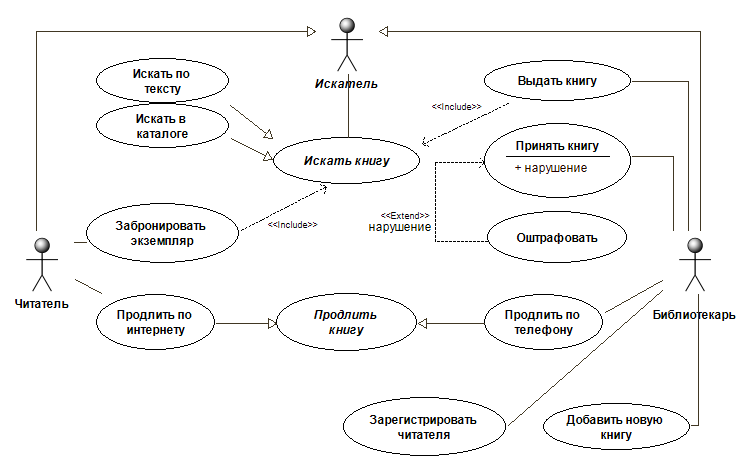
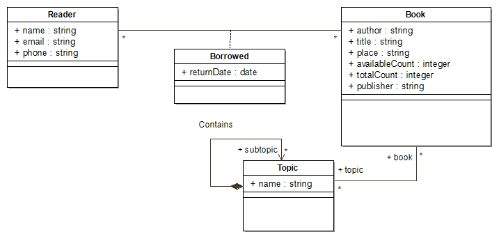
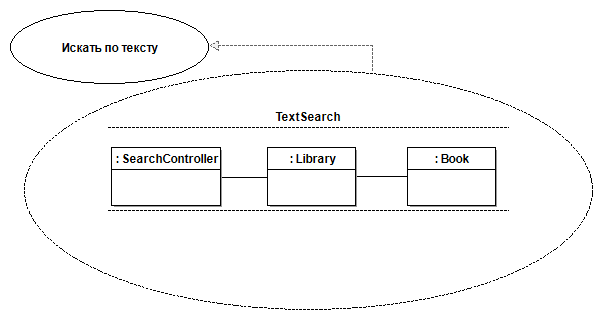
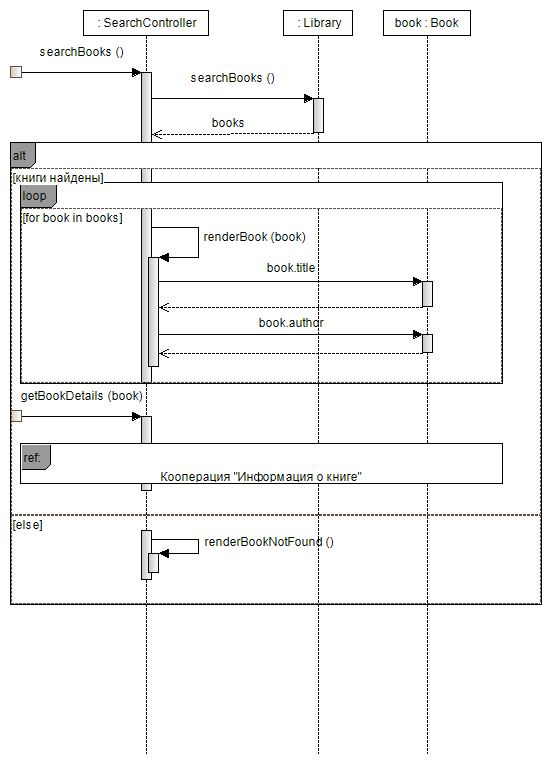
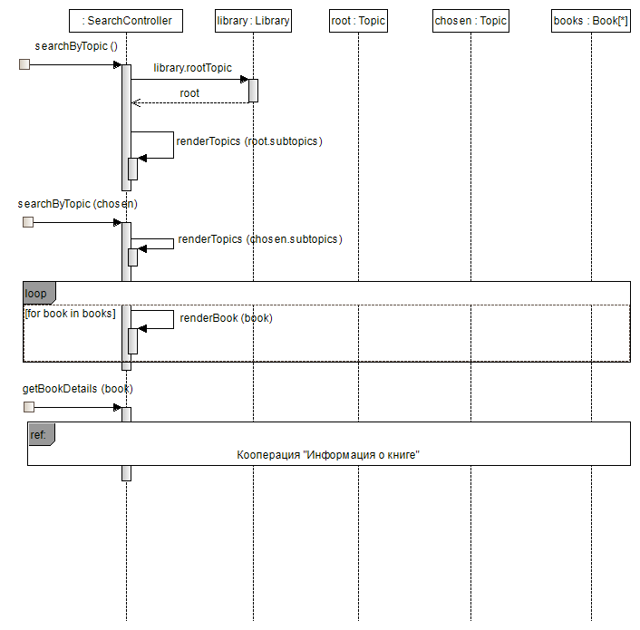
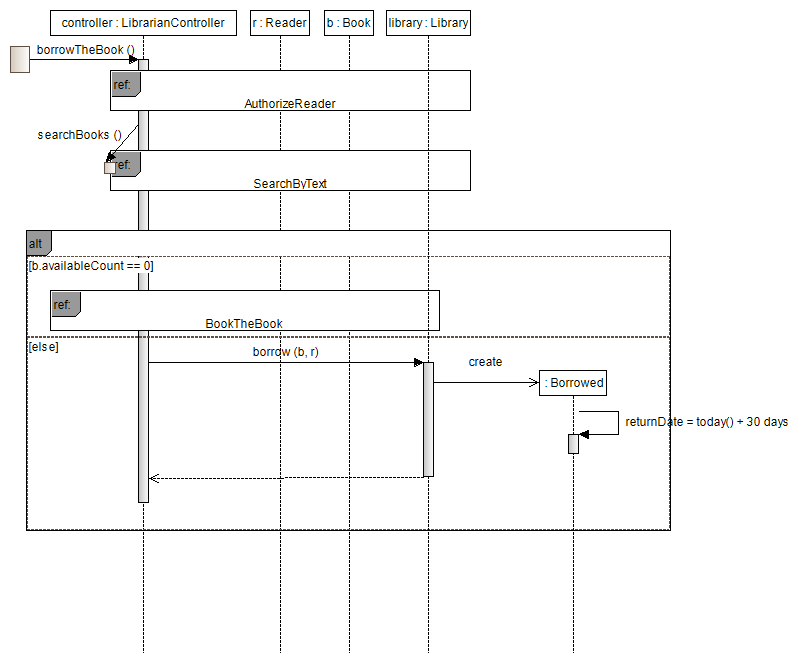
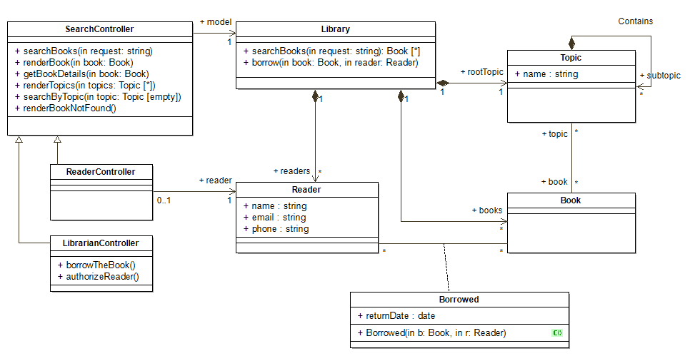

# Модель анализа

В этой части представлена логическая модель проектируемой информационной системы

## Суть модели

Логическая модель - модель предметной области. И хотя предметная область библиотеки не является чем-то сложным, в процессе проектирования требуется 

## Выделение классов

### Метод именных групп

Выпишем существительные из текста задачи. Сопоставим каждому чуществительному возможный класс.

| Существительное | Место в модели |
|-----------------|----------------|
|система          | абстрактно, не имеет значения |
|библиотека       | система целиком, не класс |
|книга            | Класс |
|автор            | Атрибут книги. Как класс хранил бы мало информации |
|издательство     | Атрибут книги. Как класс хранил бы мало информации |
|тематика         | см. Тематический каталог |
|наличие          | не класс, но требование хранить состояние всех книг (доступна/на руках) |
|сайт             | Деталь реализации. См. раздел "Обновленная структурная модель" |
|учет             | Функциональное требование (отглагольное сущ.) |
|абонемент        | Отдел библиотеки. В нашей задаче не имеет смысла |
|срок окончания   | атрибут книги, взятой на руки |
|полнотекстовый поиск | Деталь реализации. Подразумевается поиск в атрибутах класса Книга |
|тематический каталог | Иерархия тем. Нужен класс для реализации |
|Литература       | синоним "Книга". Сливаем вместе |
|читатель         | Нужен класс для представления пользователя в системе |
|на дом           | Не класс, но состояние книги |
|срок 30 дней     | атрибут книги, взятой на руки |
|возврат документов| От глагола "возвратить". Не класс |
|денежная компенсация| Класс не нужен. Скорее от глагола "компенсировать" |
|Продление        | От глагола "продлить". Не класс |
|истечения основного срока| От "истекать". Похоже на временной сигнал |
|телефон          | Класс не нужен. Функциональное требование |
|интернет         | Класс не нужен. Функциональное требование |

Выпишем глаголы и отглагольные существительные. Сопоставим галголам операции классов или Варианты использования

| Глагол            | Место в Модели                             |
|-------------------| ------------------------------------------ |
|искать             | Вариант использования "Искать книгу"       |
|узнавать о наличии | Часть ВИ "Искать книгу"                    |
|вести учет         | ВИ "Выдать книгу", "Принять книгу"         |
|извещать           | ВИ "Известить о сроке возврата"            |
|выдается на срок   | Часть требования "вести учет"              |
|возврата (срок)    | часть других ВИ                            |
|уплатить           | ВИ "Оштрафовать"                           |
|Продление          | ВИ "Продлить"                              |

### Дополнительные соображения

Очевидно, чтобы вести учет выданных книг, нужн хранить *какая книга* выдана и *кому* выдана. Нам нужен класс для хранения информации о читателе. Назовем его `Reader`.

|           Reader             ||
| ------------- | ------------- |
| хранит ФИО   | Book  |
| хранит email  |   |
| хранит телефон |    |

Также нам нужен класс, хранящий информацию о книге `Book`. Это не указано явно в тексте задачи, но в библиотеке много одинаковых книг. Что должен моделировать объект класса книга: издание или отдельный экземпляр? В нашей задаче не нужно отличать отдельные экземпляры книг. Это даже вредно: если два читателя по ошибке поменяются экземплярами, процесс возврата будет усложнен.
Итак книга - это издание. Чтобы хранить информацию о доступности и отдельных экземплярах, введем атрибуты "Количество кземпляров", "Количество доступных экземпляров".

|           Book             ||
| ------------- | ------------- |
| хранит Название   | Topic  |
| хранит Автора  |   |
| хранит количество экземпляров  |   |
| хранит количество доступных экз-ов  |     |

Книга, выданная читателю на руки будет моделироваться ассоциацией `Borrowed` ("на руках"). Срок выдачи удобно сделать атрибутом этой ассоциации, будем использовать класс ассоциации.

Тематический каталог представляет собой дерево категорий `Topic`.

## Модель использования

Искать книгу может как `Читатель`, так и `Библиотекарь`. Естественно для этого ввести действуещее лицо (актора) `Искатель`, обобщающее акторов, которым доступен поиск. Тот факт, что библиотекарю в результате поиска нужно отобразить служебную информацию (адрес шкафа, полки, где размещены экземпляры книги), можно игнорировать в логической модели или перенести в ВИ `Выдать книгу`.

Обратите внимание, не `Читатель` берет книгу, а `Библиотекарь` выдаёт. Именно обязанность библиотекаря зарегистрировать факт выдачи книги. Аналогично в ВИ `Принять книгу` - взаимодействие с системой в стенах библиотеки ведёт `Библиотекарь`.

Также обратите внимание, что продление через сайт инициируется `Читателем`, а продление по телефону инициируется `Библиотекарем`.

## Структурная модель

Обратите внимание, множественность `*` у ассоциации `Borrowed` со стороны `Reader` означает, что конкретная книга может быть свзяана выдана разным читателям, ведь объект книги это множество бумажных экземпляров.

## Реализация вариантов использования

Для некоторых наиболее важных ВИ построим текстовое описание и модель поведения.

### ВИ "Искать по тексту"

Читатель или библиотекарь по текстовому запросу ищут конкретную книгу в библиотеке.

#### Текстовая реализация

* Акторы:​​​ Искатель
* Цель:​​​ ​Получить список книг
* Предусловия:​​​ -
* Постусловия:​​​ Каждая найденная книга удовлетворяет тексту запроса
* Основной​​ ​​сценарий:
	1. Актор вводит текст запроса.
	2. Актор видит книги `Book`, автор или название которых содержит текст запроса.
	3. Актор выбирает искомую книгу.
* Альтернативный сценарий:
	2. Актор видит сообщение, что книги не найдены.

#### Модель поведения

Для того, чтобы моделировать поиск книг, естественно ввести операцию найти книги `searchBooks( request:string ) : Book[*]`. Какому классу назначить эту ответственность? Добавим класс библиотека `Library`. Согласно паттерну GRASP *Pure Fabrication* он не соответствует объектам предметной области, а нужен лишь для выполнения некоторых обязанностей. Однако, удобно думать о `Library` как о центральном объекте системы, который "хранит" все прочие объекты: читателей, книги, тематический каталог.

Откуда приходят запросы? Как отображаются результаты? Эти вопросы детально прорабатываются в модели реализации. Однако на данном этапе удобно ввести класс `SearcherController`, согласно паттерну GRASP *Controller*. Это будет точка входа в логическую модель.

Кооперация, реализующая поведение ВИ "Искать по тексту" будет выглядеть так:

Основной сценарий взаимодействия представим в виде диаграммы последовательности:

Обратите внимание, сейчас нам не важно, как именно работает `searchBooks`. Это можнет быть полный перебор объектов с сопоставлением текста или запрос в базу данных с помощью поискового индекса. Оставим это модели реализации.

Также мы не детализируем, как именно происходит рендеринг книги для пользователя - опять же, на усмотрение реализации.

Получение детальной информации по книге не является частью сценария, но будет полезно отобразить на диаграмме свзязь между вариантами использования.

### ВИ "Искать в каталоге"

Читатель или библиотекарь ищут конкретную книгу, зная тематику.

#### Текстовая реализация

* Акторы:​​​ Искатель
* Цель:​​​ ​Получить список книг
* Предусловия:​​​ -
* Постусловия:​​​ Каждая найденная книга удовлетворяет искомой тематике
* Основной​​ ​​сценарий:
	1. Актор выбирает тему из списка.
	2. Актору видит список дочерних тем и несколько книг с заданной темой.
	3. Актор выбирает дочернюю тему.
	4. Актору видит список дочерних тем (при наличии) и первые 10 книг с заданной темой.
	5. Актор выбирает искомую книгу.

#### Модель поведения

Кооперация, реализующая данный ВИ содержит `SearchController`, `Library`, `Topic` (кратность 1..*), и книги `Book` (кратность *).

Покажем поведение на примере двух выбранных тем:

### ВИ "Выдать книгу"

Безуслово, ключевой ВИ системы. Библиотекарь выдаёт книгу читателю и вносит об этом информацию в систему.

Тут можно было бы моделировать отказ выдать книгу при условии, что у читателя слишком много книг на руках, но для простоты мы опустим это поведение, к тому же этого нет в тексте постановки задачи.

#### Текстовая реализация

* Акторы:​​​ Библиотекарь
* Цель:​​​ Зарегистрировать выданную читателю книгу
* Предусловия:​​​ -
* Постусловия:​​​ -
* Основной​​ ​​сценарий:
	1. ВИ "Авторизовать читателя"
	2. ВИ "Искать книгу"
	3. Если книга свободна, Библиотекарь назначает книгу пользователю со стандартным сроком возврата.
* Альтернативный сценарий:
	3. Если книга занята, предложить Читателю забронировать книгу на другую дату.
	4. ВИ "Забронировать книгу"

#### Модель поведения

Кооперация, реализующая данный ВИ содержит `LibrarianController`, `Library`, `Book`, `Reader`, `Borrowed`.

Обратите внимание, вызов searchBooks() в данном сценарии делает сам `controller`. На диаграмме последовательности ВИ "Искать по тексту" видно, что с этого вызова начинается последовательность. Это демонстрирует применение шлюзов (gates) и найденных сообщений.

## Обновленная структурная модель

В результате анализа вариантов использования в структурную модель были включены классы-контроллеры `SearchController`, `ReaderController`, `LibrarianController`, а также класс самой библиотеки `Library`, представляющий владение остальными объектами системы.

В существующие классы были добавлены методы. В частности, появился конструктор класса-ассоциации `Borrowed`, заполняющий дату возврата книги.

Обратите внимание! Класс `Reader` и класс `ReaderController` - не одно и то же. `Reader` - это то, как библиотека видит читателя. `ReaderController` - это то, как читатель видит библиотеку, собственно это интерфейс библиотеки для читателя.

## Собственное поведение классов